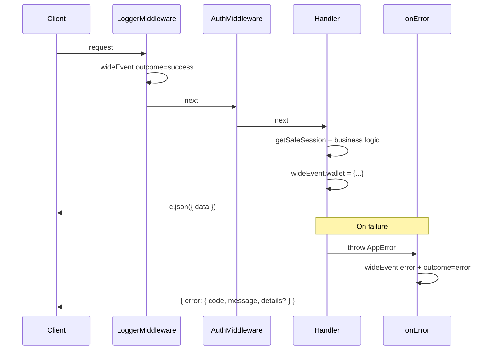

# API Route Handlers

Conventions for writing Hono route handlers in `apps/api`. The reference implementation is [`apps/api/src/routes/wallets.ts`](../../apps/api/src/routes/wallets.ts).

## Overview

Each route group is a factory function (e.g. `createWalletRoutes(db, auth)`) that returns a `Hono` sub-app. Routes are mounted in [`apps/api/src/app.ts`](../../apps/api/src/app.ts).

Middleware runs in this order for `/api/*` requests:

1. **CORS** — all routes
2. **Logger** — creates `wideEvent` and `requestId` on context
3. **Auth** — resolves session; throws `AppError` when unauthenticated
4. **Route handler**
5. **`onError`** — app-level handler in [`apps/api/src/lib/error.ts`](../../apps/api/src/lib/error.ts); catches thrown errors and returns a consistent JSON shape



Handlers should **not** wrap business logic in try/catch for logging or error formatting. Throw `AppError` and let `onError` handle the response and wide-event enrichment.

## Response contracts

### Success

```json
{
  "data": { ... }
}
```

Use `200` for reads/updates and `201` for creates:

```ts
return c.json({ data: wallets })
return c.json({ data: newWallet }, 201)
```

### Error

```json
{
  "error": {
    "code": "WALLET_NOT_FOUND",
    "message": "Wallet not found",
    "details": { "name": ["Wallet name is required"] }
  }
}
```

- `code` — stable identifier for clients and tests (see `ERROR_CODES`)
- `message` — human-readable summary
- `details` — optional; field-level validation messages keyed by path (e.g. `"name"`, `"initial_balance"`)

## AppError and ERROR_CODES

[`AppError`](../../apps/api/src/lib/error.ts) extends Hono's `HTTPException` and carries a `code` plus optional `details`.

```ts
import { AppError } from '../lib/error'
import { ERROR_CODES } from '../lib/error-codes'

if (!walletData) {
  throw new AppError(404, ERROR_CODES.WALLET.NOT_FOUND, 'Wallet not found')
}
```

Domain codes live in [`apps/api/src/lib/error-codes.ts`](../../apps/api/src/lib/error-codes.ts):

| Domain | Example codes |
|--------|---------------|
| `AUTH` | `AUTH_UNAUTHORIZED`, `AUTH_FORBIDDEN` |
| `WALLET` | `WALLET_NOT_FOUND`, `WALLET_CONFLICT` |
| `VALIDATION` | `VALIDATION_INVALID_INPUT` |
| `INTERNAL` | `INTERNAL_SERVER_ERROR` |

**Adding a new code:** extend `ERROR_CODES` under the relevant domain, then throw `AppError` with that code in the handler.

The global `onError` handler:

- Returns `error.toJSON()` for `AppError` instances
- Sets `wideEvent.outcome = 'error'` and `wideEvent.error = { code, message, details? }`
- Maps unexpected errors to `INTERNAL_SERVER_ERROR` (500)

## Authentication

Protected routes under `/api/*` use auth middleware plus `getSafeSession(c)` in the handler:

```ts
const { user } = getSafeSession(c)
```

`getSafeSession` reads `user` and `session` from Hono context (set by auth middleware). If either is missing, it throws `AppError` with `ERROR_CODES.AUTH.UNAUTHORIZED`.

Do **not** return inline `{ error: '...' }` or `{ user: null }` for auth failures on protected routes — use `AppError` for a consistent shape.

## Input validation

Use [`validator()`](../../apps/api/src/lib/validator.ts) instead of raw `@hono/zod-validator`:

```ts
import { validator } from '../lib/validator'

.post('/', validator('json', createWalletSchema), async c => {
  const { name, type, initial_balance } = c.req.valid('json')
  // ...
})
```

On validation failure, `validator` throws `AppError` with:

- Status `400`
- Code `ERROR_CODES.VALIDATION.INVALID_INPUT`
- `details` — map of field path → array of messages

Example validation error response:

```json
{
  "error": {
    "code": "VALIDATION_INVALID_INPUT",
    "message": "Validation failed",
    "details": {
      "name": ["Wallet name is required"]
    }
  }
}
```

Define Zod schemas in the route file (or extract to a shared module when reused).

## Wide event logging

The logger middleware ([`apps/api/src/middleware/logger.ts`](../../apps/api/src/middleware/logger.ts)) emits one structured log line per `/api/*` request. Handlers enrich `c.get('wideEvent')` with **business context on the success path only**.

Use **nested domain keys** — group related fields under a namespace:

```ts
const wideEvent = c.get('wideEvent')

// List wallets
wideEvent.wallet = { count: wallets.length }

// Get single wallet
wideEvent.wallet = { id: walletId, record_count: walletData.records.length }

// Delete wallet
wideEvent.wallet = { id: walletId, deleted_record_count: walletData.records.length }
```

| Layer | Responsibility |
|-------|----------------|
| Logger middleware | `request_id`, `method`, `path`, `timestamp`, `outcome` (default `success`), `status_code`, `duration_ms` |
| Handler (success) | Domain context — e.g. `wideEvent.wallet`, future `wideEvent.record` |
| `onError` (failure) | `wideEvent.outcome = 'error'`, `wideEvent.error = { code, message, details? }` |

Handlers do **not** set `wideEvent.outcome` or `wideEvent.error` manually.

## Handler template

```ts
.get('/:id', async c => {
  const { user } = getSafeSession(c)
  const wideEvent = c.get('wideEvent')
  const walletId = c.req.param('id')

  const walletData = await db.query.wallet.findFirst({
    where: and(eq(wallet.id, walletId), eq(wallet.userId, user.id)),
    with: { records: { orderBy: (record, { desc }) => [desc(record.date)], limit: 10 } },
  })

  if (!walletData) {
    throw new AppError(404, ERROR_CODES.WALLET.NOT_FOUND, 'Wallet not found')
  }

  wideEvent.wallet = { id: walletId, record_count: walletData.records.length }
  return c.json({ data: walletData })
})
```

## Route factory checklist

When adding a new route group:

1. Create `apps/api/src/routes/{name}.ts` exporting `create{Name}Routes(deps)`
2. Chain handlers on `new Hono()` with paths relative to `/` (mount prefix is set in `app.ts`)
3. Use `getSafeSession(c)` for authenticated handlers
4. Use `validator('json' | 'param' | 'query', schema)` for validated inputs
5. Throw `AppError` for domain errors — do not `return c.json({ error: ... }, status)`
6. Return `{ data: ... }` on success
7. Annotate `wideEvent` with nested domain keys on success
8. Register in `createApp()`: `.route('/api/{name}', create{Name}Routes(...))`
9. Add error codes to `ERROR_CODES` if needed
10. Add integration tests — see [API Testing](./testing.md)

## Reference implementation

- Routes: [`apps/api/src/routes/wallets.ts`](../../apps/api/src/routes/wallets.ts)
- Tests: [`apps/api/src/__tests__/wallets.test.ts`](../../apps/api/src/__tests__/wallets.test.ts)
- Error handling: [`apps/api/src/lib/error.ts`](../../apps/api/src/lib/error.ts)
- Validation: [`apps/api/src/lib/validator.ts`](../../apps/api/src/lib/validator.ts)
