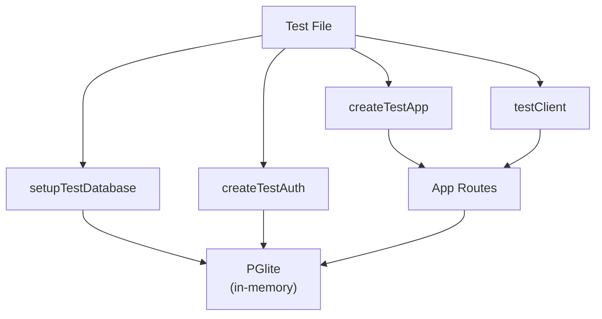

# API Testing Conventions

Testing best practices and setup for the KaGet API (`apps/api`). For route handler patterns (errors, validation, logging), see [API Route Handlers](./api-route-handlers.md).

## Overview

The API test suite uses:

- **PGlite** — in-process PostgreSQL for fast, isolated tests
- **better-auth testUtils plugin** — real session/user creation and authentication
- **Hono testClient** — typed RPC client for route assertions
- **Vitest** — test runner and assertion library
- **Assertion helpers** — `expectSuccess` / `expectError` for typed response checks

The reference test suite is [`apps/api/src/__tests__/wallets.test.ts`](../../apps/api/src/__tests__/wallets.test.ts).

## Setup

### Database (`setupTestDatabase`)

Located in `src/__tests__/helpers/db.ts`, this utility:

1. Creates an in-memory PGlite instance
2. Runs all migrations from `migrations/` directory
3. Returns a Drizzle ORM connection and cleanup functions

**Usage:**

```ts
import { setupTestDatabase } from './helpers/db'

beforeAll(async () => {
  const testDatabase = await setupTestDatabase()
  // testDatabase.db is a Drizzle connection
})

afterAll(async () => {
  await testDatabase.close()
})
```

### Authentication (`createTestAuth`)

Located in `src/__tests__/helpers/auth.ts`, this utility:

1. Creates a test-only `betterAuth` instance with the `testUtils()` plugin
2. Connects it to the same PGlite DB as the rest of the tests
3. Exposes `test` helpers for user/session creation

**Key helpers:**

| Helper | Purpose |
| --- | --- |
| `test.createUser(overrides?)` | Create a user object (not persisted) |
| `test.saveUser(user)` | Persist user to DB |
| `test.getAuthHeaders({ userId })` | Create a real session and return `Headers` with session cookie |
| `getTestAuthHeaders(test, userId)` | Same as above, returns `Record<string, string>` for `testClient` |
| `test.deleteUser(userId)` | Remove user from DB |

**Usage:**

```ts
import { createTestAuth, getTestAuthHeaders } from './helpers/auth'

let authHeaders: Record<string, string>

beforeAll(async () => {
  const testDatabase = await setupTestDatabase()
  const { auth, test } = await createTestAuth(testDatabase.db)

  const user = test.createUser({ email: 'test@example.com' })
  await test.saveUser(user)
  authHeaders = await getTestAuthHeaders(test, user.id)
})
```

Prefer `getTestAuthHeaders` over `test.getAuthHeaders` — it returns a plain object you can pass directly to `testClient` without `Object.fromEntries(headers.entries())`.

### App Factory (`createTestApp`)

Located in `src/__tests__/helpers/app.ts`, wraps `createApp` with test env config from `helpers/mock.ts`:

```ts
import { createTestApp } from './helpers/app'

const app = createTestApp(testDatabase.db, auth)
```

### Test Client (`testClient`)

From `hono/testing`, creates a typed RPC client that routes through the app in-process:

```ts
import { testClient } from 'hono/testing'

const client = testClient(createTestApp(testDatabase.db, auth))

const res = await client.api.wallets.$post(
  { json: { name: 'My Wallet', type: 'DIGITAL' } },
  { headers: authHeaders },
)
```

## Assertion helpers

Located in `src/__tests__/helpers/assertions.ts`. These replace manual status checks and union-type narrowing on `res.json()`.

### `expectSuccess`

Asserts status, verifies the body has a `data` property, and returns the parsed JSON body.

```ts
import { expectSuccess } from './helpers/assertions'

const { data } = await expectSuccess(res, 201)
expect(data).toMatchObject({ name: 'My Savings', type: 'DIGITAL' })
```

Signature:

```ts
expectSuccess<T = unknown>(res: ClientResponse<T>, status = 200): Promise<T>
```

Destructure `{ data }` from the result — handlers return `{ data: ... }`.

### `expectError`

Asserts failure status, `res.ok === false`, and that `error.code` matches the expected code.

```ts
import { expectError } from './helpers/assertions'
import { ERROR_CODES } from '../lib/error-codes'

await expectError(res, ERROR_CODES.WALLET.NOT_FOUND, 404)
await expectError(res, ERROR_CODES.VALIDATION.INVALID_INPUT, 400)
await expectError(res, ERROR_CODES.AUTH.UNAUTHORIZED, 401)
```

Signature:

```ts
expectError(res: Response, code: string, status?: number): Promise<ErrorResponse['error']>
```

Import codes from [`ERROR_CODES`](../../apps/api/src/lib/error-codes.ts) — do not hardcode string literals in tests.

## Complete test example

Mirrors [`wallets.test.ts`](../../apps/api/src/__tests__/wallets.test.ts):

```ts
import { eq } from 'drizzle-orm'
import { testClient } from 'hono/testing'
import { afterAll, beforeAll, describe, expect, it } from 'vitest'
import { ERROR_CODES } from '../lib/error-codes'
import { createTestApp } from './helpers/app'
import { expectError, expectSuccess } from './helpers/assertions'
import { createTestAuth, getTestAuthHeaders } from './helpers/auth'
import { setupTestDatabase } from './helpers/db'

describe('Wallets API', () => {
  let testDatabase: Awaited<ReturnType<typeof setupTestDatabase>>
  let authHeaders: Record<string, string>
  let client: ReturnType<typeof testClient<ReturnType<typeof createTestApp>>>

  beforeAll(async () => {
    testDatabase = await setupTestDatabase()
    const { auth, test } = await createTestAuth(testDatabase.db)

    const user = test.createUser({ email: 'test@example.com', name: 'Test User' })
    await test.saveUser(user)
    authHeaders = await getTestAuthHeaders(test, user.id)

    client = testClient(createTestApp(testDatabase.db, auth))
  })

  afterAll(async () => {
    await testDatabase.close()
  })

  it('should create a wallet', async () => {
    const res = await client.api.wallets.$post(
      { json: { name: 'My Savings', type: 'DIGITAL', initial_balance: 0 } },
      { headers: authHeaders },
    )

    const { data } = await expectSuccess(res, 201)
    expect(data).toMatchObject({ name: 'My Savings', type: 'DIGITAL', balance: '0.0000' })
  })

  it('should return 404 for non-existent wallet', async () => {
    const res = await client.api.wallets[':id'].$get(
      { param: { id: 'non-existent-id' } },
      { headers: authHeaders },
    )

    await expectError(res, ERROR_CODES.WALLET.NOT_FOUND, 404)
  })

  it('should reject unauthorized requests', async () => {
    const res = await client.api.wallets.$get()

    await expectError(res, ERROR_CODES.AUTH.UNAUTHORIZED, 401)
  })

  it('should reject invalid input', async () => {
    const res = await client.api.wallets.$post(
      { json: { name: '', type: 'DIGITAL' } },
      { headers: authHeaders },
    )

    await expectError(res, ERROR_CODES.VALIDATION.INVALID_INPUT, 400)
  })
})
```

## Side-effect assertions

When the HTTP response alone is not enough (e.g. cascade deletes), query Drizzle directly via `testDatabase.db`:

```ts
const records = await testDatabase.db.query.record.findMany({
  where: rec => eq(rec.walletId, walletId!),
})
expect(records).toHaveLength(0)
```

## Running tests

From `apps/api`:

```bash
# Single run
bun run test

# Watch mode
bun run test:watch
```

From the repository root:

```bash
bun run test
```

> API tests are not run in CI today (see root `.github/workflows/ci.yml`).

## Best practices

1. **One test database per suite** — Create in `beforeAll`, call `close()` in `afterAll`
2. **One auth context per suite** — Create `auth` and `test` once, reuse throughout
3. **Use `getTestAuthHeaders`** — Avoid repeating `Object.fromEntries(authHeaders.entries())`
4. **Use `expectSuccess` / `expectError`** — Assert status and response shape in one call
5. **Use `ERROR_CODES` in tests** — Keeps assertions aligned with handler error codes
6. **Use testClient RPC** — Typed routes; avoid raw `app.request()` calls
7. **Pass headers per-request** — Second parameter: `{ headers: authHeaders }`
8. **Group by endpoint** — Nested `describe('GET /wallets/:id', ...)` blocks

## File layout

```
apps/api/src/__tests__/
├── helpers/
│   ├── assertions.ts  # expectSuccess, expectError
│   ├── auth.ts        # createTestAuth, getTestAuthHeaders
│   ├── app.ts         # createTestApp(db, auth)
│   ├── db.ts          # setupTestDatabase()
│   └── mock.ts        # MOCK_ENV for test app config
└── wallets.test.ts    # Reference test suite
```

## Architecture



The test database and auth instance share the same PGlite instance. Sessions created via `getTestAuthHeaders` are valid for the app's auth middleware because both use the same DB. The `testClient` routes requests through the app in-process without real HTTP.

## Notes on `better-auth/plugins`

The `testUtils` plugin is part of the test-only auth instance (`createTestAuth`), not the production auth (`apps/api/src/lib/auth.ts`). This preserves production security while providing privileged test helpers at runtime.

For more details, see the [better-auth testUtils documentation](https://www.better-auth.com/docs/plugins/test-utils).
