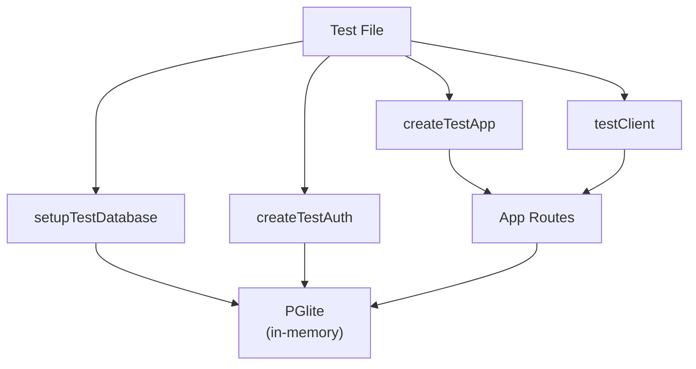

# API Testing Conventions

Testing best practices and setup for the KaGet API (`apps/api`).

## Overview

The API test suite uses:

- **PGlite** — in-process PostgreSQL for fast, isolated tests
- **better-auth testUtils plugin** — real session/user creation and authentication
- **Hono testClient** — typed RPC client for route assertions
- **Vitest** — test runner and assertion library

## Setup

### Database (`setupTestDatabase`)

Located in `src/__tests__/helpers/db.ts`, this utility:

1. Creates an in-memory PGlite instance
2. Runs all migrations from `migrations/` directory
3. Returns a Drizzle ORM connection and cleanup functions

**Usage:**

```ts
import { setupTestDatabase } from './helpers/db'

beforeAll(async () => {
  const testDatabase = await setupTestDatabase()
  // testDatabase.db is a Drizzle connection
  // testDatabase.close() cleans up after tests
})

afterAll(() => testDatabase.close())
```

### Authentication (`createTestAuth`)

Located in `src/__tests__/helpers/auth.ts`, this utility:

1. Creates a test-only `betterAuth` instance with the `testUtils()` plugin
2. Connects it to the same PGlite DB as the rest of the tests
3. Exposes `test` helpers for user/session creation

**Key helpers:**

| Helper | Purpose |
| --- | --- |
| `test.createUser(overrides?)` | Create a user object (not persisted) |
| `test.saveUser(user)` | Persist user to DB |
| `test.getAuthHeaders({ userId })` | Create a real session and return `Headers` with session cookie |
| `test.deleteUser(userId)` | Remove user from DB |

**Usage:**

```ts
import { createTestAuth } from './helpers/auth'

let authHeaders: Headers

beforeAll(async () => {
  const testDatabase = await setupTestDatabase()
  const { auth, test } = await createTestAuth(testDatabase.db)

  const user = test.createUser({ email: 'test@example.com' })
  await test.saveUser(user)
  authHeaders = await test.getAuthHeaders({ userId: user.id })
})
```

### App Factory (`createTestApp`)

Located in `src/__tests__/helpers/app.ts`, wraps `createApp` with test env config:

```ts
import { createTestApp } from './helpers/app'

const app = createTestApp(testDatabase.db, auth)
```

### Test Client (`testClient`)

From `hono/testing`, creates a typed RPC client that routes through the app in-process:

```ts
import { testClient } from 'hono/testing'

const client = testClient(createTestApp(testDatabase.db, auth))

// Typed RPC calls
const res = await client.api.wallets.$post(
  { json: { name: 'My Wallet', type: 'DIGITAL' } },
  { headers: authHeaders }
)
expect(res.status).toBe(201)
```

## Complete Test Example

```ts
import { testClient } from 'hono/testing'
import { describe, it, expect, beforeAll, afterAll } from 'vitest'
import { createTestApp } from './helpers/app'
import { createTestAuth } from './helpers/auth'
import { setupTestDatabase } from './helpers/db'

describe('Protected API', () => {
  let testDatabase: Awaited<ReturnType<typeof setupTestDatabase>>
  let authHeaders: Headers
  let client: ReturnType<typeof testClient<ReturnType<typeof createTestApp>>>

  beforeAll(async () => {
    testDatabase = await setupTestDatabase()
    const { auth, test } = await createTestAuth(testDatabase.db)

    const user = test.createUser({ email: 'test@example.com' })
    await test.saveUser(user)
    authHeaders = await test.getAuthHeaders({ userId: user.id })

    client = testClient(createTestApp(testDatabase.db, auth))
  })

  afterAll(() => testDatabase.close())

  it('should return data for authenticated requests', async () => {
    const res = await client.api.data.$get({}, { headers: authHeaders })
    expect(res.status).toBe(200)
    const json = await res.json()
    expect(json).toBeDefined()
  })

  it('should reject unauthenticated requests', async () => {
    const res = await client.api.data.$get({})
    expect(res.status).toBe(401)
  })
})
```

## Running Tests

From `apps/api`:

```bash
# Single run
bun run test

# Watch mode
bun run test:watch
```

## Best Practices

1. **One test database per suite** — Create in `beforeAll`, clean up in `afterAll`
2. **One auth context per suite** — Create `auth` and `test` once, reuse throughout
3. **Use testClient RPC** — Avoid raw `app.request()` calls; `testClient` provides type safety
4. **Pass headers per-request** — Second parameter to RPC calls: `{ headers: authHeaders }`
5. **Clean up in afterAll** — Always call `testDatabase.close()` to release PGlite resources

## File Layout

```
apps/api/src/__tests__/
├── helpers/
│   ├── auth.ts        # createTestAuth(db) → { auth, test }
│   ├── app.ts         # createTestApp(db, auth) → app
│   └── db.ts          # setupTestDatabase() → { db, close, teardown }
└── wallets.test.ts    # Example test suite
```

## Architecture



The test database and auth instance share the same PGlite instance. Sessions created via `test.getAuthHeaders()` are valid for the app's auth middleware because both use the same DB. The `testClient` routes requests through the app in-process without real HTTP.

## Notes on `better-auth/plugins`

The `testUtils` plugin is part of the test-only auth instance (`createTestAuth`), not the production auth (`apps/api/src/lib/auth.ts`). This preserves production security while providing privileged test helpers at runtime.

For more details, see the [better-auth testUtils documentation](https://www.better-auth.com/docs/plugins/test-utils).
